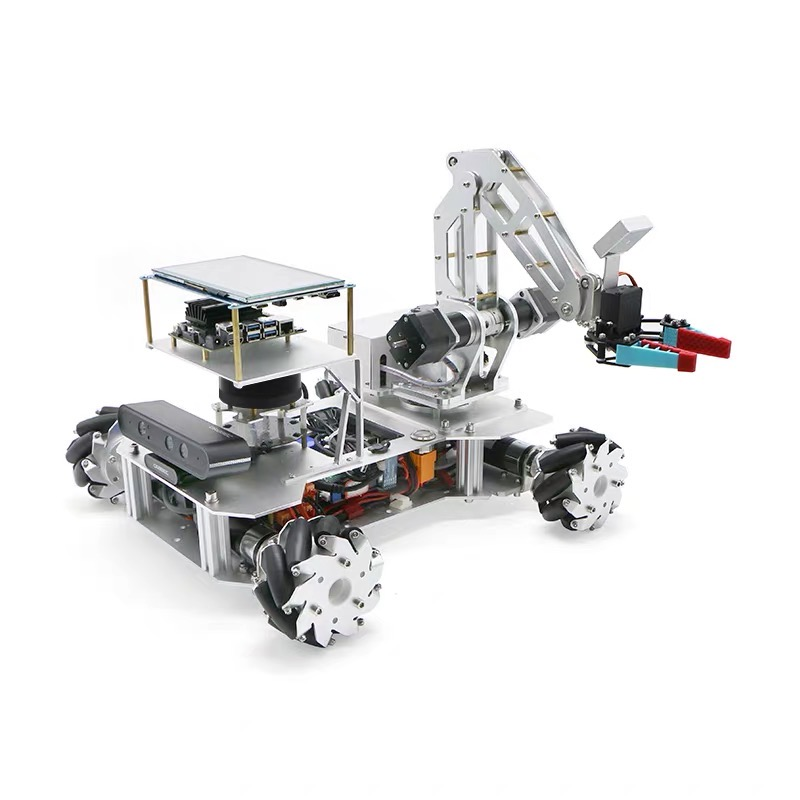

# PuppyGo

Vision language model and large language model powered embodied agent.

  

    
    
  

## Here’s what I did:

- Language Models as Zero-Shot Planners: Extracting Actionable Knowledge for Embodied Agents
- extracts affordances and constraints from large language models and vision-language models to compose 3D value maps, which are used by motion planners to zero-shot synthesize trajectories for everyday manipulation tasks.
- combine with e2e large model trainning framework, like UniAD;

## This Package Is Sponsorware 💰💰💰

 https://github.com/sponsors/Charmve?frequency=one-time&sponsor=Charmve

This repo was only available to my sponsors on GitHub Sponsors until I reached 15 sponsors.

Learn more about **Sponsorware** at [github.com/sponsorware/docs](https://github.com/sponsorware/docs) 💰.

 

## Execution under Disturbances

Because the language model output stays the same throughout the task, we can cache its output and re-evaluate the generated code using closed-loop visual feedback, which enables fast replanning using MPC. This enables VoxPoser to be robust to online disturbances.
      

  

    <video id="dist1" controls="" muted="" autoplay="" loop="" width="99%">
      <source src="src/sort-trash-to-tray-dist.mp4" type="video/mp4">
    </video>
    

      "Sort the paper trash into the blue tray."
    

  

  

    <video id="dist2" controls="" muted="" autoplay="" loop="" width="99%">
      <source src="src/close-top-drawer-dist.mp4" type="video/mp4">
    </video>
    

      "Close the top drawer."
    

  

